# Codeblock Customizer Plugin

[](https://github.com/mugiwara85/CodeblockCustomizer/releases/latest)
[](https://obsidian.md/plugins?id=codeblock-customizer)

This is a plugin for [Obsidian.md](https://obsidian.md) which lets you customize the codeblocks in both editing mode and reading mode.

I couldn't find any plugin, where I could customize codeblocks which works reliably and in both editing and reading mode so I created my own!

> **Warning**  
> If you used version 1.1.9, then you must delete the `data.json` file from `VaultFolder/.obsidian/plugins/codeblock-customizer/`. This only needs to happen once but is necessary as the file does not contain a few entries which are required by version 2.0.0 or above. After that, everything should work fine.

## Settings

### Excluded Languages

The plugin can be set to ignore certain languages (for example if another plugin uses this codeblock language). These are set in settings as a comma separated list. The wildcard \* operator can also be used to match languages such as 'ad-*' to match admonitions. This wildcard can be either at the beginning or the end of the language.

### Themes

The plugin comes with a 'Default' theme and a few themes based on popular color schemes. The default theme uses colors as defined by the existing Obsidian theme to minimise changes in appearance on install (it uses the CSS variables defined by the current theme).

All themes have customizable colors for both light and dark mode (to make changes to a specific mode, change to that mode first and then change the colors in settings). Each theme also includes other appearance settings such as displaying line numbers, allowing highlights to cover the line numbers and more.

When a setting or color is changed within a theme, that change is not saved to the theme; you must then click the update button next to the theme name to update that theme to the current settings. Note that changes to the built-in themes cannot be saved.

The different component colors that can be set within a theme are:

- Codeblock background color
- Codeblock text color
- Line number gutter background color
- Line number text color
- Codeblock line number current line indicator
- Codeblock header background color
- Codeblock header title text color
- Codeblock header separator color
- Codeblock header language tag background color
- Codeblock header language tag text color
- Editor active line highlight color
- Codeblock active line highlight color
- Default highlight color
- Alternative highlight colors
- Button color
- Button active color

'Default' theme colors in dark mode with Default Obsidian theme:

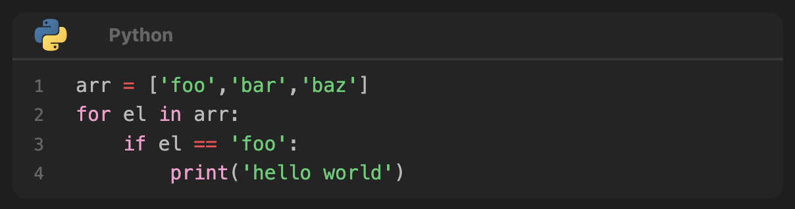

'Default' theme colors in light mode with Default Obsidian theme:


'Default' theme colors in dark mode with [Obsidianite](https://github.com/bennyxguo/Obsidian-Obsidianite) theme:

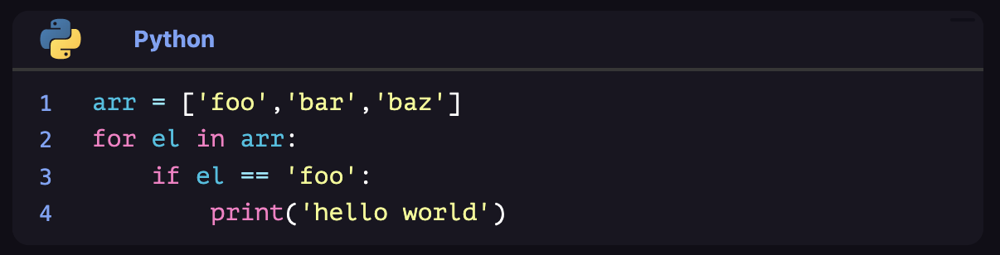

'Solarized' theme colors in dark mode with Default Obsidian theme:


I am not a designer, so if you have created a cool theme, send me the color codes, and I might include it as a default theme in the next release :-\)

## Parameters

Codeblock parameters are added to the first line of the codeblock following the language. They can be added in any order. If no language is set, a space should be left after the codeblock delimiter ` ``` ` to indicate that the first parameter is NOT the language of the codeblock.

Example:

- ` ```cpp fold title:example_title`
- ` ```cpp title:example_title fold` (same effect as above line)
- ` ``` fold title:example_title` (if no language set)

### Line Numbers

Line numbers can be enabled/disabled within a specific theme in the settings of that theme. In addition to this, whether line numbering is applied can be additionally specified in a codeblock itself using the `ln` parameter.

Setting `ln:true` will always show line numbering, `ln:false` will never show line numbering, and `ln:NUMBER` (e.g.`ln:27`) will always show line numbering starting at the specified number (so an offset of this number minus one).

### Title

To display a title for a codeblock specify `title:` followed by a title in the first line of the codeblock. If the title contains spaces, specify it between `""` or `''` e.g.: `title:"long filename.cpp"`.

Example:

` ```cpp title:test.cpp`

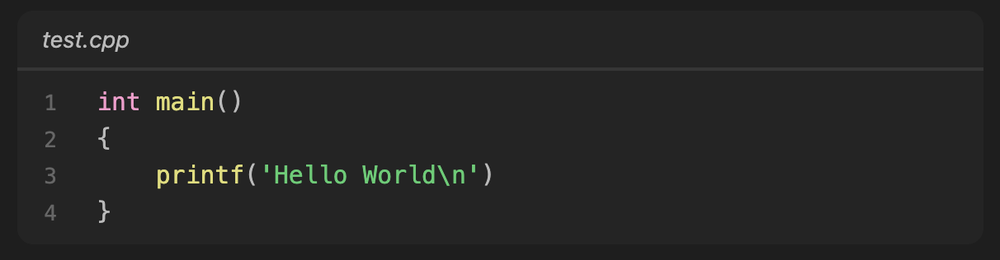

` ```cpp title:"long filename.cpp"`

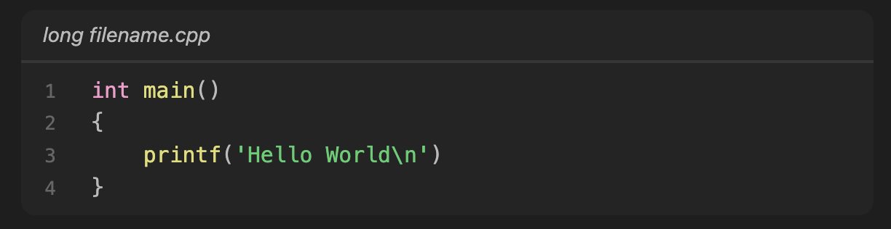

### Folding

To specify an initial fold state when the document is opened, use the `fold` parameter. If `fold` is set in a codeblock, then when you open the document, the codeblock will be automatically collapsed, and only the header will be displayed. You can unfold the codeblock by clicking on the header.

Clicking on any header will toggle the fold for that codeblock.

When no `title` parameter is set, the folded codeblock will have a default fold placeholder title. This can be changed in settings, or it can be changed for a specific parameter by setting a string after the fold parameter as in `fold:Folded` or `fold:"Collapsed Codeblock"`.

Example:

` ```cpp fold`

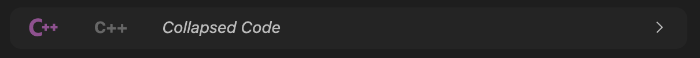

` ```cpp fold:"This is collapsed"`

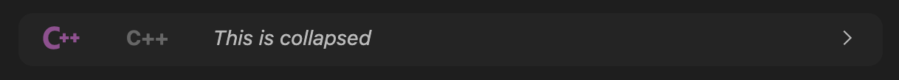

Clicking on header
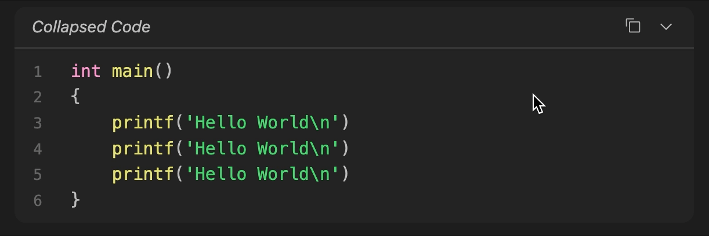

### Highlighting

To highlight lines, specify `hl:` followed by line numbers, plain text or regular expressions in the first line of the codeblock.

You can specify any of the following highlight types separated with commas (**without spaces**) e.g.: `hl:1,3-4,foo,'bar baz',"bar and baz",/#\w{6}/`.

- Single numbers: `hl:1` would highlight the first line
- Number ranges: `hl:1-3` would highlight lines 1 through to 3
- Plain text: `hl:foo` would highlight lines with the word `foo` inside them
- Plain text in speech marks or quotation marks: `hl:'bar baz'` or `hl:"bar baz"` would highlight lines with the word `bar baz` inside them
- Regular Expressions: `hl:/#\w{6}/` would highlight lines which match this regular expression (tested by `regex.test(line)`) - for this example any lines with hexadecimal colors are highlighted

Combinations of these will highlight all relevant lines.

Example:
` ```cpp hl:1,3-4,foo,'bar baz',"bar and baz",/#\w{6}/`

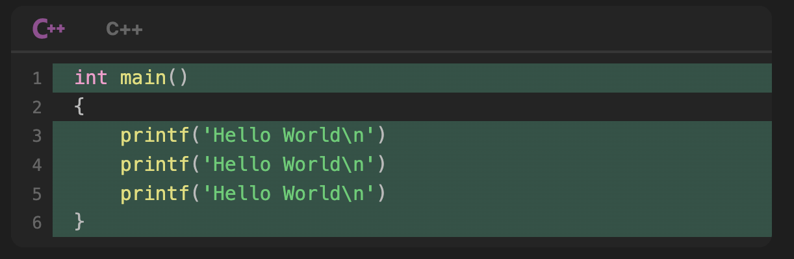

Highlights can be set to also highlight line numbers as well as the code in settings.

Example:
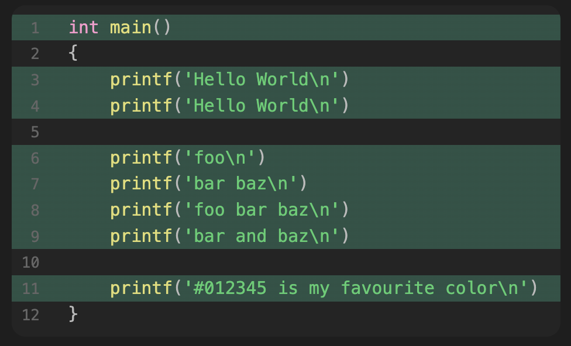

Highlights created by the default highlight parameter or alternative highlight parameters can be set to appear as gradient highlights which fade out to the right in the settings. A color stop percentage for this gradient can also be set.

Example:
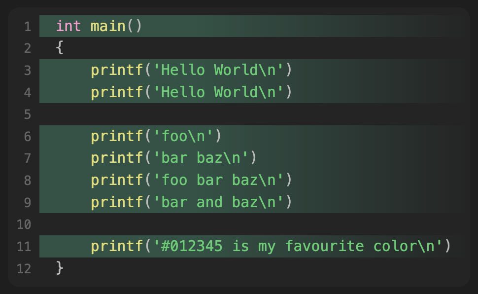

#### Alternative Highlights

You can also define multiple highlight colors by defining an alternative highlight color with a name. This name will be used as a parameter, and you can use it just like with the `hl` parameter.

Example:

You could add three further types of highlight colors (`info`, `warn`, `error`). After adding these in settings and setting colors as desired, you can use it in the first line of codeblocks:

` ```cpp info:2 warn:4-6 error:8`

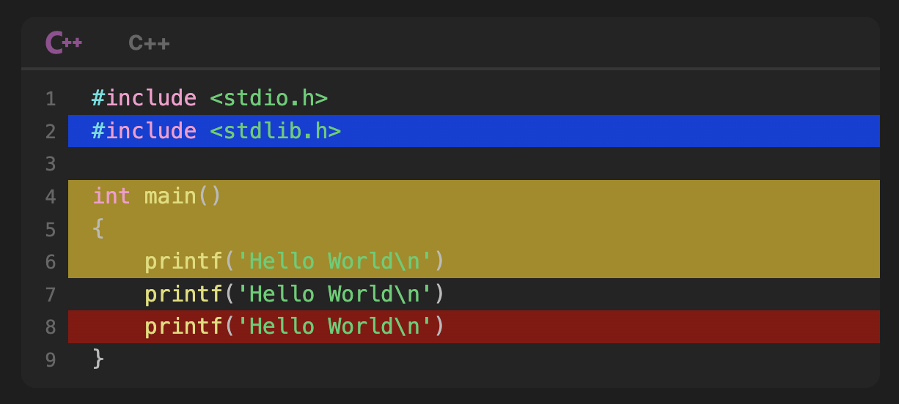

Corresponding settings:

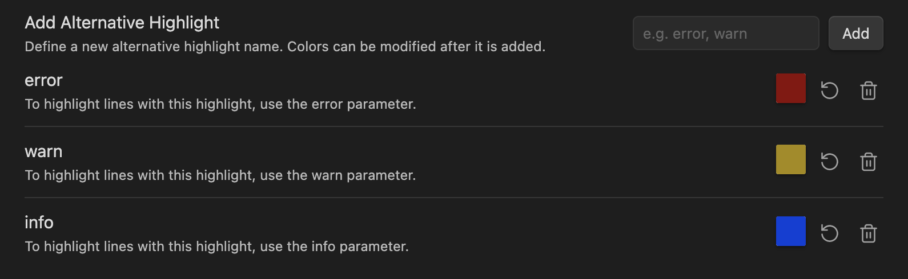

### Unwrap

Whether lines wrap or note can be set in the settings. There is an advanced option called "Wrap Lines on Click" where holding the mouse down on a codeblock's content will cause the content to be wrapped (if line unwrapping is already set in the settings).

These settings can also be set on a per codeblock basis using the `unwrap` parameter which overrides the settings. Setting `unwrap:true` will unwrap lines in the codeblock, setting `unwrap:false` will wrap lines in the codeblock, and setting `unwrap:inactive` will unwrap lines in the codeblock but will wrap them when the mouse is held down on the codeblock.

Example:

` ```python unwrap:true`
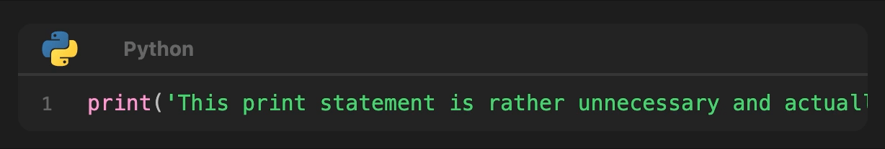

` ```python unwrap:false`


` ```python unwrap:inactive`
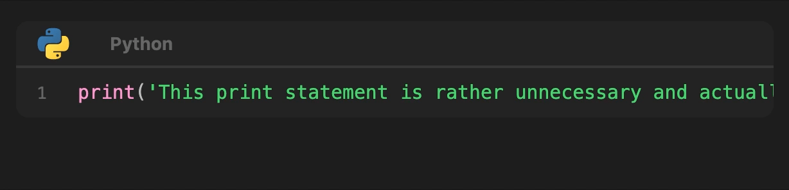

### Ignore

In addition to excluding the language, the plugin can be told to not apply to a specific codeblock by including the `ignore` parameter.

The plugin can further be told to not apply to a specific file by adding `codeblock-customizer-ignore: true` to the frontmatter of the note.

Example:

` ```cpp ignore`
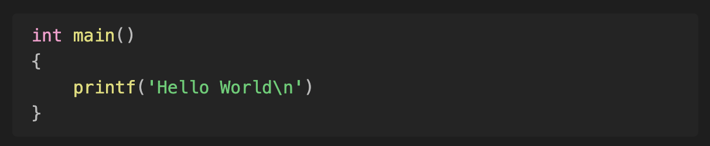

`codeblock-customizer-ignore: true`
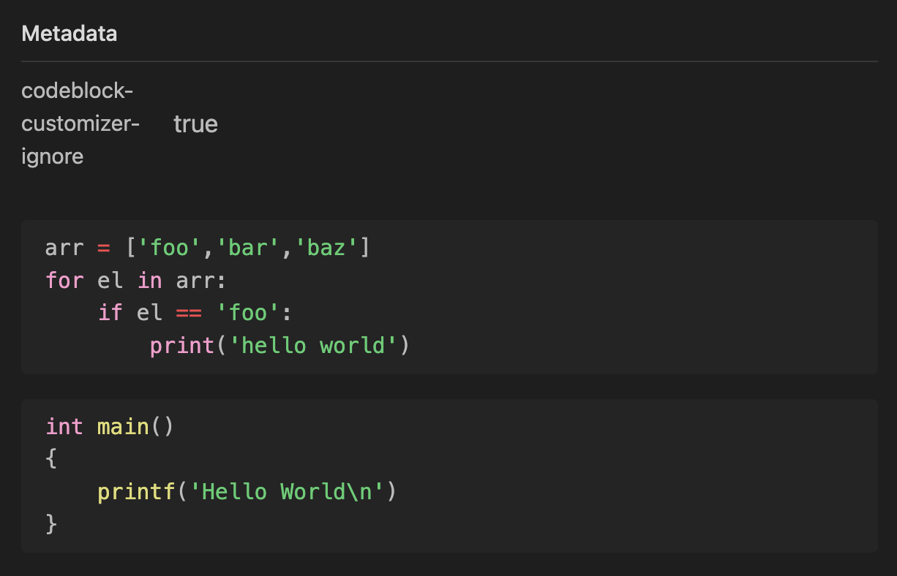

## Appearance

### Codeblock

Codeblocks can have their curvature changed in settings to make them appear more or less rounded.

They can also have colored left borders based on the language (colors match the language icon) if enabled in settings. The width of this border can also be changed.

Example:

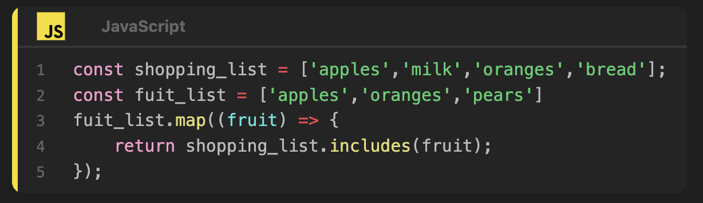

### Header

The header is displayed in the following cases:

- You specified a `title:`
- You specified `fold` If you specified `fold` but did not specify `title:` or `fold:` a default text from settings will be displayed on the header (the default is 'Collapsed Code')
- You defined a codeblock language via ` ```language` and set the `Display Header Language Tags` setting to `Always` or the `Display Header Language Icons` setting to `Always` in the theme settings

If the header is displayed, folding works as well. If the `Display Header Language Tags` setting is set to `Always`, then the header will display the codeblock language always and if it is set to `If Header Shown`, it will only display when the header is displayed (i.e. the `title` parameter is set).

You can enable the option in the settings page to display icons in the header. When this option is set to `If Header Shown`, if the language specified in the codeblock has an icon and the codeblock header is displayed (i.e. the `title` parameter is set), then the icon will be displayed. When this option is set to `Always`, the header with icon will always be shown if the language specified in the codeblock has an icon. Icons can also be set to grayscale or resized in settings. There are currently around 170 icons available for different languages.

The language tag text and title text can also be styled to be bold and/or italic as well as a specific font. Furthermore, the font-size of the header text can be changed.

Example:

- No header


- Header with fold only
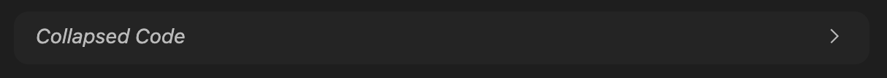

- Header with codeblock language only


- Header with codeblock language and title as well
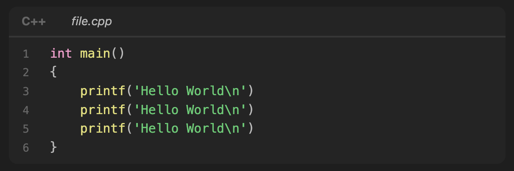

- Header with codeblock language, title and icon as well
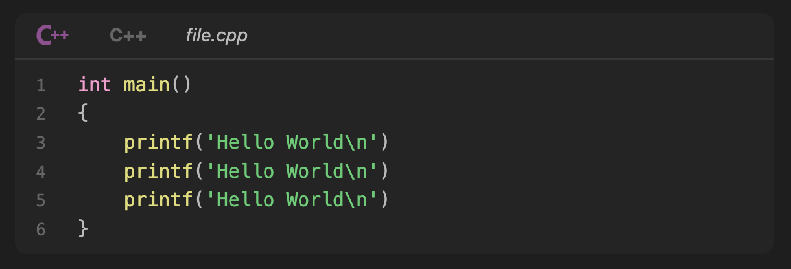

### Active Line Indicators

The active line inside codeblocks can be highlighted with a custom color if enabled in settings. It can also be indicated by a different color line number if this setting is also enabled in settings.

The active line outside codeblocks can also be highlighted with a custom color if enabled in settings.

Example:


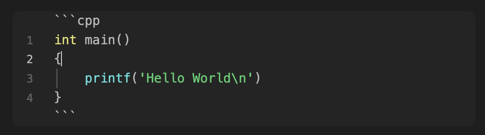

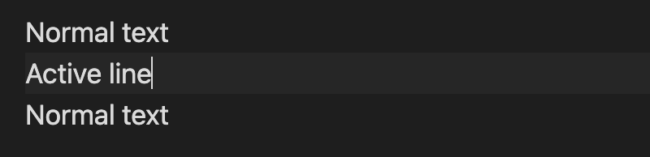

## Plugin Compatibility

This plugin is also compatible with the following obsidian plugins out of the box:

[](https://github.com/twibiral/obsidian-execute-code)
[](https://github.com/zjhcn/obsidian-code-preview)
[](https://github.com/tillahoffmann/obsidian-file-include)

## Roadmap

Take a look at the [changelog](CHANGELOG.md) to see what has changed in past versions.

### Future Work

- Implementation
  - Sort colors by language based on icon in `setting.ts`
- Features
  - Add commands to fold all, unfold all and reset default fold for codeblocks
  - Let users redirect certain languages to alternative icons and colors
- Appearance
  - Live Preview appearances
    - Copy button location
    - Language border
  - Fix large line numbers margin padding in editing mode
  - Work with all themes and readable line length setting
- Check the feasibility of
  - Implementing code wrapping for editing mode
  - Implementing folding animations for editing mode
<!-- Compatibility with [RunJS](https://github.com/eoureo/obsidian-runjs) plugin -->

### Existing Issues

- First pickr change does not change color correctly
- Editing Mode
  - Weird scroll in live preview when click (due to `codeblockHeader` codemirror extension) when first line is a codeblock.
  - If a language is excluded, it currently needs to be unfolded before it can be removed or it disappears.
  - Moving the cursor next to a collapsed codeblock and typing can cause it to disappear.
- Reading Mode
  - Codeblocks flash when changed if editing side by side in editing mode.
  - Scrollbar does not show behind line gutter
  - Selecting codeblocks, copying and then pasting in reading mode includes line numbers and header titles.
  - [Docstring syntax highlighting issue](https://github.com/mugiwara85/CodeblockCustomizer/issues/17).
- PDF Exporting
  - Highlights appear slightly different.
  - Language border colors are not correctly set.

### Upstream Issues

- Instant reading mode updating when parameters are changed
  - Requires Obsidian to parse postMarkdown changes following the codeblock language (see this [issue](https://forum.obsidian.md/t/postprocessor-does-not-process-changes-after-codeblock-language/61010) and this [issue](https://forum.obsidian.md/t/pass-parameters-to-codeblock/37990)).

## How to install the plugin

- Simply install directly from Obsidian
- Alternatively you can just copy over `main.js`, `styles.css`, `manifest.json` to your vault `VaultFolder/.obsidian/plugins/codeblock-customizer/` or use the [Obsidian Beta Reviewers Plugin](https://github.com/TfTHacker/obsidian42-brat).

## Contributions

All contributions are welcome, just create a merge request.

Please try to create bug reports/issues that are:

- **Reproducible**: Include steps to recreate the issue
- **Specific**: Include relevant details such as possible plugin conflicts, theme conflicts etc.
- **Unique**: Please do not duplicate existing open issues, add to the existing issue
- **Scoped**: Please create a separate issue for each bug you've identified

The bullet points in [roadmap](#roadmap) are a good place to start!

### Maintainers

[@mugiwara85](https://github.com/mugiwara85)

### Contributors

[](https://github.com/mugiwara85/CodeblockCustomizer/graphs/contributors)

*Made with [contrib.rocks](https://contrib.rocks).*

## Support

If you like this plugin, and would like to help support continued development, use the button below!

[](https://www.buymeacoffee.com/ThePirateKing)

## License

Distributed under the MIT License. See `LICENSE` for more information.
