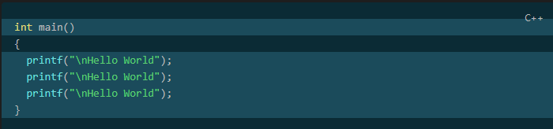
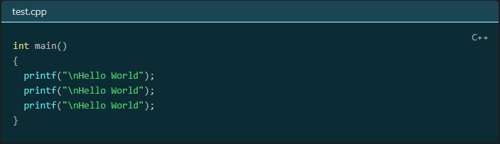
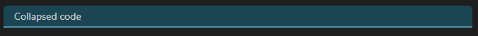
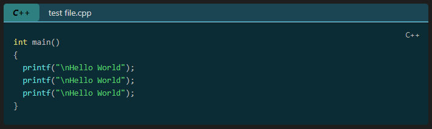

# Codeblock Customizer Plugin

This is a plugin for Obsidian (https://obsidian.md).

Since I didn't find any plugin, where I could customize codeblocks, which works realiable, and works in editor and reading mode as well, I created my own. I am not a designer, so if you have created a cool theme, send me the color codes, and I might include it as a default theme in the next release :-)

This plugin works in editor mode and in reading mode!

The plugin lets you customize the codeblocks in the following way:
- Default dark and light theme. You can create your own themes as well.
- Enable editor active line highlight. The active line in Obsidian (including codeblocks) will be highlighted (you can customize the color).
- Exclude languages. You can define languages separated by a comma, to which the plugin will not apply
- Enable codeblock active line highlight. The active line inside a codeblock will be highlighted (you can customize the color)
- Set background color for codeblocks
- Lets you highlight specific lines
    - Customize highlight color
- Display filename
    - If a filename is defined a header will be inserted, where it is possible to customize the text (color, bold, italic), and the header (color, header line) itself as well
- Fold code
    - If the header is displayed (either by defining filename or other way explained below), you can click on the header to fold the codeblock below it 
- Display codeblock language. This displays the language (if specified) of the codeblock in the header. 
    - Customize text color, background color, bold text, italic text for the language tag inside the header.
    - By default the language tag is only displayed, if the header is displayed, and a if a language is defined for a codeblock. You can however force, to always display the codeblock language, even if the header would not be displayed.
- Add line numbers to codeblocks
    - Customize if the linenumber should also be highlighted, if a line is highlighted
    - Customize background color, and color of the line numbers

## Themes

Default dark theme:


Default light theme:


## Highlighting

To highlight lines specifiy `hl:` folowed by line numbers in the first line of the codeblock. 
- You can specify either single line numbers separated with a comma e.g.: `hl:1,3,5,7`.
- You can specify ranges e.g.: `hl:2-5` This would highlight lines from 2 to 5. 
- You can also combine the methods e.g.: `hl:1,3,4-6` This would highlight lines 1, 3 and lines from 4 to 6.

Example:
` ```cpp hl:1,3,4-6`



## Display filename

To display a filename specify `file:` followed by a filename in the first line of the codeblock. If the filename contains space, specify it between `""` e.g.: `file:"long filename.cpp"`.

Example:
` ```cpp file:test.cpp`
` ```cpp file:"long filename.cpp"`



## Folding

To specify an initial fold state when the document is opened, specify `fold` in the first line of the codeblock. If `fold` is defined in a codeblock, then when you open the document, the codeblock will be automatically collapsed, and only the header will be displayed. You can unfold the codeblock by clicking on the header.

Example:
` ```cpp fold`


## Header

The header is displayed in the following cases:
- You specified a `file:`
- You specified `fold` If you specified `fold` but did not specify `file:` a default text `Collapsed code` will be displayed on the header
- You enabled the `Always display codeblock language` option in settings, but did not specify `file:` or `fold`

If the header is displayed, folding works as well. If `Always display codeblock language` is enabled then the header will display the codeblock language as well.

Example:
- Header with fold only

- Header with codeblock language only

- Header with codeblock language and filename as well


## Line numbers

To enable line numbers go to the plugin settings and enable the `Enable line numbers` option. After that the line numbers will be displayed before codeblocks.

Example:

**Note:** The only reliable way to display line numbers is to display them in a gutter. This means however that they will be displayed before the codeblock, and not inside the codeblock. It is also possible to display line numbers inside codeblocks (this would have been my preferred way), but that way it is possible to delete the line numbers, and long lines are not handled correctly. Therefore this option was dismissed. In reading mode it is the other way around. Line numbers are displayed inside the codeblocks, and not before them. 

Example for reading mode:


## How to install the plugin

- Simply install directly from Obsidian
- or you can just copy over `main.js`, `styles.css`, `manifest.json` to your vault `VaultFolder/.obsidian/plugins/codeblock-customizer/`.

## Support

If you like this plugin, and would like to help support continued development, use the button below!

<a href="https://www.buymeacoffee.com/ThePirateKing"></a>
