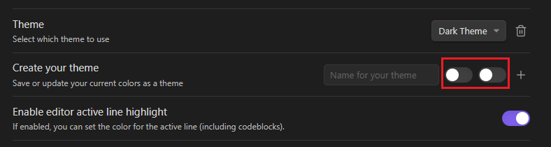
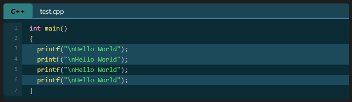

# Codeblock Customizer Plugin

This is a plugin for Obsidian (https://obsidian.md).


Since I didn't find any plugin, where I could customize codeblocks, which works realiable, and works in editor and reading mode as well, I created my own. I am not a designer, so if you have created a cool theme, send me the color codes, and I might include it as a default theme in the next release :-)

This plugin works in editor mode and in reading mode!

The plugin lets you customize the codeblocks in the following way:
- Default dark and light theme. You can create your own themes as well.
- Enable editor active line highlight. The active line in Obsidian (including codeblocks) will be highlighted (you can customize the color).
- Enable codeblock active line highlight. The active line inside a codeblock will be highlighted (you can customize the color).
- Exclude languages. You can define languages separated by a comma, to which the plugin will not apply.
- Set background color for codeblocks.
- Lets you highlight specific lines.
    - Customize highlight color
- Lets you define multiple highlight colors to highlight lines.
- Display filename
    - If a filename is defined a header will be inserted, where it is possible to customize the text (color, bold, italic), and the header (color, header line) itself as well
- Fold code
    - If the header is displayed (either by defining filename or other way explained below), you can click on the header to fold the codeblock below it 
- Display codeblock language. This displays the language (if specified) of the codeblock in the header. 
    - Customize text color, background color, bold text, italic text for the language tag inside the header.
    - By default the language tag is only displayed, if the header is displayed, and a if a language is defined for a codeblock. You can however force, to always display the codeblock language, even if the header would not be displayed.
- Display codeblock language icon (if available for the specified language) in the header.
- Add line numbers to codeblocks
    - Customize if the linenumber should also be highlighted, if a line is highlighted
    - Customize background color, and color of the line numbers

## Themes

Default dark theme: 


Default light theme: 


The plugin automatically sets the default theme, according to the selected mode in Obsidian(Dark/Light). You can customize your colors, and then save them as a "theme". There are two toggles when you create a theme, as shown below:



If you change Obsidians theme frequentely, and you want to use your themes, then these two toggles are important for you. If you save a theme, and you want to use that theme in either dark or light mode by default, then set the appropriate toggle. This way you set your theme as the default light or dark theme.

## Highlighting

### Main highlight

To highlight lines specifiy `hl:` folowed by line numbers in the first line of the codeblock. 
- You can specify either single line numbers separated with a comma e.g.: `hl:1,3,5,7`.
- You can specify ranges e.g.: `hl:2-5` This would highlight lines from 2 to 5. 
- You can also combine the methods e.g.: `hl:1,3,4-6` This would highlight lines 1, 3 and lines from 4 to 6.

Example:
` ```cpp hl:1,3,4-6`


### Alternative highlight

With version `1.1.0` this new feature is released. From now on, you can define multiple hihglight colors. This means, that you have to define a name for the highlight color. This name will be used as a parameter, and you can use it just like with the `hl` parameter. 
Example: 
You define three types of highlight colors (`info`, `warn`, `error`). After that specify the color for the light and dark themes. A dark theme will use the specified dark color, and a light theme, will use the specified light color. After that you can use it in the first line of codeblocks:
` ```cpp info:2 warn:4-6 error:8`

![[Pasted_image_20230314211256.png]](attachments/Pasted_image_20230314211256.png)

Example codeblock with multiple highlight colors:

![[Pasted_image_20230314211417.png]](attachments/Pasted_image_20230314211417.png)

## Display filename

To display a filename specify `file:` followed by a filename in the first line of the codeblock. If the filename contains space, specify it between `""` e.g.: `file:"long filename.cpp"`.

Example:
` ```cpp file:test.cpp`
` ```cpp file:"long filename.cpp"`


## Folding

To specify an initial fold state when the document is opened, specify `fold` in the first line of the codeblock. If `fold` is defined in a codeblock, then when you open the document, the codeblock will be automatically collapsed, and only the header will be displayed. You can unfold the codeblock by clicking on the header.

Example:
` ```cpp fold`


## Icon

Version `1.1.0` introduces a new feature. It is possible from now on, to display an icon for the codeblocks. There are currently around 170 icons available for different languages. You can enable the option in the settings page to display icons in the header. If you enable this option, and if the language specified in the codeblock has an icon, and the header is displayed, then the icon will be displayed. You can also force to always display the icon (which also means that the header will be also displayed) even if the header is not displayed, because the `file` parameter is not defined.

## Header

The header is displayed in the following cases:
- You specified a `file:`
- You specified `fold` If you specified `fold` but did not specify `file:` a default text `Collapsed code` will be displayed on the header
- You enabled the `Always display codeblock language` or the `Always display codeblock language icon` option in settings, but did not specify `file:` or `fold`

If the header is displayed, folding works as well. If `Always display codeblock language` is enabled then the header will display the codeblock language as well.

Example:
- Header with fold only


- Header with codeblock language only


- Header with codeblock language and filename as well


- Header with codeblock language, filename and icon as well

![[Pasted_image_20230314212111.png]](attachments/Pasted_image_20230314212111.png)

## Line numbers

To enable line numbers go to the plugin settings and enable the `Enable line numbers` option. After that the line numbers will be displayed before codeblocks. 
**Note:** The method how line numbers were displayed before version `1.1.0` does not exist anymore. Line numbers are displayed from now on, as shown below.

Example:

![[Pasted_image_20230314211657.png]](attachments/Pasted_image_20230314211657.png)

Example for reading mode:



## Note

If you used version 1.0.0, then you must delete the `data.json` file from `VaultFolder/.obsidian/plugins/codeblock-customizer/` Only one time. This is neccesary as the file does not contain a few entries which are required by version 1.0.1 or above. After that, everything should work fine.

## How to install the plugin

- Simply install directly from Obsidian
- or you can just copy over `main.js`, `styles.css`, `manifest.json` to your vault `VaultFolder/.obsidian/plugins/codeblock-customizer/`.

## Support

If you like this plugin, and would like to help support continued development, use the button below!
 
<a href="https://www.buymeacoffee.com/ThePirateKing"></a>
