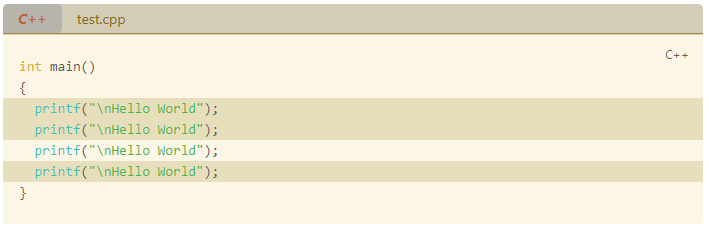
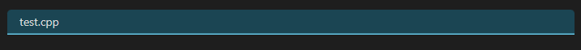
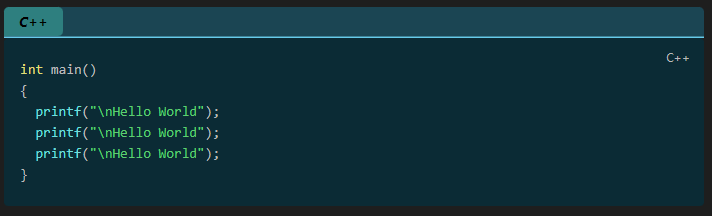

# Codeblock Customizer Plugin

[](https://github.com/mugiwara85/CodeblockCustomizer/releases/latest)
[](https://obsidian.md/plugins?id=codeblock-customizer)

This is a plugin for [Obsidian.md](https://obsidian.md).

I couldn't find any plugin, where I could customize codeblocks which works reliably and in both editing and reading mode so I created my own.

This plugin lets you customize the codeblocks in the following way in both editing mode and reading mode:

TODO Section

- Default dark and light theme. You can create your own themes as well.
- Enable editor active line highlight. The active line in Obsidian (including codeblocks) will be highlighted (you can customize the color).
- Enable codeblock active line highlight. The active line inside a codeblock will be highlighted (you can customize the color).
- Exclude languages. You can define languages separated by a comma, to which the plugin will not apply.
- Set background color for codeblocks.
- Lets you highlight specific lines.
  - Customize highlight color
- Lets you define multiple highlight colors to highlight lines.
- Display filename
  - If a filename is defined a header will be inserted, where it is possible to customize the text (color, bold, italic), and the header (color, header line) itself as well
- Fold code
  - If the header is displayed (either by defining filename or other way explained below), you can click on the header to fold the codeblock below it
- Display codeblock language. This displays the language (if specified) of the codeblock in the header.
  - Customize text color, background color, bold text, italic text for the language tag inside the header.
  - By default the language tag is only displayed, if the header is displayed, and a if a language is defined for a codeblock. You can however force, to always display the codeblock language, even if the header would not be displayed.
- Display codeblock language icon (if available for the specified language) in the header.
- Add line numbers to codeblocks
  - Customize if the linenumber should also be highlighted, if a line is highlighted
  - Customize background color, and color of the line numbers

## Settings

### Excluded Languages

The plugin can be set to ignore certain languages (for example if another plugin uses this codeblock language). These are set in settings as a comma separated list. The wildcard \* operator can also be used to match languages such as 'ad-*' to match admonitions.

### Themes

The plugin comes with a 'Default' theme and a few themes based on popular color schemes. The default theme uses colors as defined by the existing Obsidian theme to minimise changes in appearance on install (it uses the CSS variables defined by the current theme).

All themes have customizable colors for both light and dark mode (to make changes to a specific mode, change to that mode first and then change the colors in settings). Each theme also includes other appearance settings such as displaying line numbers, allowing highlights to cover the line numbers and more.

When a setting or color is changed within a theme, that change is not saved to the theme; you must then click the update button next to the theme name to update that theme to the current settings. Note that changes to the built-in themes cannot be saved.

'Default' theme in dark mode with Default Obsidian theme:

 TODO Update image

'Default' theme in light mode with Default Obsidian theme:

 TODO Update image

'Default' theme in dark mode with TODO theme:

TODO Add image

I am not a designer, so if you have created a cool theme, send me the color codes, and I might include it as a default theme in the next release :-\)

## Parameters

Codeblock parameters are added to the first line of the codeblock following the language. They can be added in any order. If no language is set, a space should be left after the codeblock delimiter ` ``` ` to indicate that the first parameter is NOT the language of the codeblock.

Example:

- ` ```cpp fold title:example_title`
- ` ```cpp title:example_title fold` (same effect as above line)
- ` ``` fold title:example_title` (if no language set)

### Line Numbers

TODO Section

Line numbers can be enabled/disabled within a specific theme in the settings of that theme. In addition to this, whether line numbering is applied can be additionally specified in a codeblock itself using the `ln` parameter.

### Title

To display a title for a codeblock specify `title:` followed by a title in the first line of the codeblock. If the title contains spaces, specify it between `""` or `''` e.g.: `title:"long filename.cpp"`.

Example:

` ```cpp title:test.cpp`

 TODO Update image

` ```cpp title:"long filename.cpp"`

TODO Add image

### Folding

To specify an initial fold state when the document is opened, use the `fold` parameter. If `fold` is set in a codeblock, then when you open the document, the codeblock will be automatically collapsed, and only the header will be displayed. You can unfold the codeblock by clicking on the header.

When no `title` parameter is set, the folded codeblock will have a default fold placeholder title. This can be changed in settings, or it can be changed for a specific parameter by setting a string after the fold parameter as in `fold:Folded` or `fold:"Collapsed Codeblock"`.

Example:

` ```cpp fold`

 TODO Update image

` ```cpp fold:"This is collapsed"`

 TODO Update image

Clicking on header
TODO Add folding gif

### Highlighting

#### Default highlights

To highlight lines, specify `hl:` followed by line numbers in the first line of the codeblock.

- You can specify either single line numbers separated with a comma e.g.: `hl:1,3,5,7`.
- You can specify ranges e.g.: `hl:2-5` This would highlight lines from 2 to 5.
- You can also combine the methods e.g.: `hl:1,3,4-6` This would highlight lines 1, 3 and lines from 4 to 6.

Example:
` ```cpp hl:1,3,4-6`

 TODO Update image

#### Alternative highlights

You can also define multiple highlight colors by defining an alternative highlight color with a name. This name will be used as a parameter, and you can use it just like with the `hl` parameter.

Example:

You could add three further types of highlight colors (`info`, `warn`, `error`). After adding these in settings and setting colors as desired, you can use it in the first line of codeblocks:

` ```cpp info:2 warn:4-6 error:8`

![[Pasted_image_20230314211417.png]](attachments/Pasted_image_20230314211417.png) TODO Update image

Corresponding settings:

![[Pasted_image_20230314211256.png]](attachments/Pasted_image_20230314211256.png) TODO Update image

### Ignore

In addition to excluding the language, the plugin can be told to not apply to a specific codeblock by including the `ignore` parameter.

The plugin can further be told to not apply to a specific file by adding `codeblock-customizer-ignore: true` to the frontmatter of the note.

Example:

` ```cpp ignore`
TODO Add image

`codeblock-customizer-ignore: true`
TODO Add image

## Appearance

### Header

The header is displayed in the following cases:

- You specified a `title:`
- You specified `fold` If you specified `fold` but did not specify `title:` or `fold:` a default text from settings will be displayed on the header (the default is 'Collapsed Code')
- You defined a codeblock language via ` ```language` and set the `Display Header Language Tags` setting to `always` or the `Display Header Language Icons` setting to `always` in the theme settings

If the header is displayed, folding works as well. If the `Display Header Language Tags` setting is set to `always`, then the header will display the codeblock language as well.

Example:

- No header
TODO Add image

- Header with fold only
 TODO Update image

- Header with codeblock language only
 TODO Update image

- Header with codeblock language and title as well
 TODO Update image

- Header with codeblock language, title and icon as well
![[Pasted_image_20230314212111.png]](attachments/Pasted_image_20230314212111.png) TODO Update image

### Icon

TODO Section

It is possible from now on, to display an icon for the codeblocks. There are currently around 170 icons available for different languages. You can enable the option in the settings page to display icons in the header. If you enable this option, and if the language specified in the codeblock has an icon, and the header is displayed, then the icon will be displayed. You can also force to always display the icon (which also means that the header will be also displayed) even if the header is not displayed, because the `title` parameter is not defined.

## Plugin Compatibility

This plugin is also compatible with the following obsidian plugins out of the box:

[](https://github.com/twibiral/obsidian-execute-code)
[](https://github.com/zjhcn/obsidian-code-preview)

## Roadmap

TODO Section

## Note

If you used version 1.0.0, then you must delete the `data.json` file from `VaultFolder/.obsidian/plugins/codeblock-customizer/` Only one time. This is necessary as the file does not contain a few entries which are required by version 1.0.1 or above. After that, everything should work fine.

## How to install the plugin

- Simply install directly from Obsidian
- Alternatively you can just copy over `main.js`, `styles.css`, `manifest.json` to your vault `VaultFolder/.obsidian/plugins/codeblock-customizer/` or use the [Obsidian Beta Reviewers Plugin](https://github.com/TfTHacker/obsidian42-brat).

## Contributions

All contributions are welcome, just create a merge request.

Please try to create bug reports/issues that are:

- **Reproducible**: Include steps to recreate the issue
- **Specific**: Include relevant details such as possible plugin conflicts, theme conflicts etc.
- **Unique**: Please do not duplicate existing open issues, add to the existing issue
- **Scoped**: Please create a separate issue for each bug you've identified

The bullet points in [roadmap](#roadmap) are a good place to start!

### Maintainers

[@mugiwara85](https://github.com/mugiwara85)

### Contributors

[](https://github.com/mugiwara85/CodeblockCustomizer/graphs/contributors)

*Made with [contrib.rocks](https://contrib.rocks).*

## Support

If you like this plugin, and would like to help support continued development, use the button below!

[](https://www.buymeacoffee.com/ThePirateKing)

## License

TODO Section
